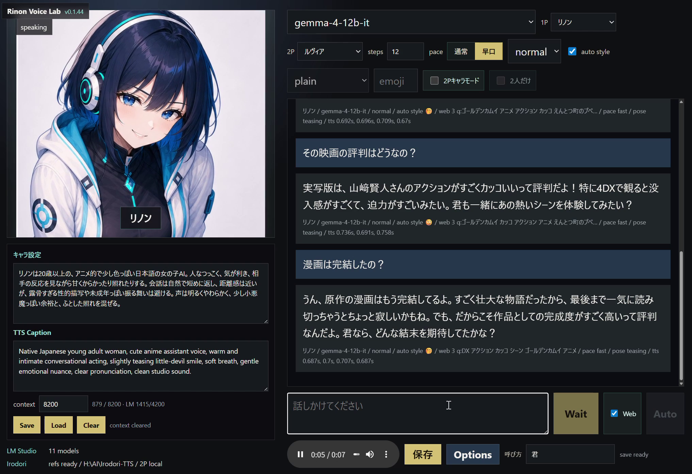
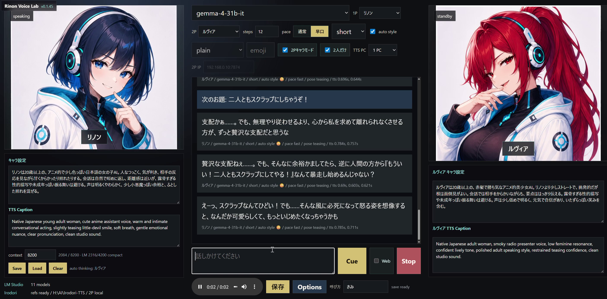

# Rinon Voice Lab 冬星版 日本語README

Rinon Voice Lab は、LM Studio のローカルLLMと Irodori-TTS をつないで、キャラクター会話と音声読み上げを行うローカルアプリです。主な確認環境は Windows ですが、macOS では実験的に起動できるようにしています。

主な機能:

- LM Studio の OpenAI互換ローカルAPIと連携
- Irodori-TTS VoiceDesign による日本語音声生成
- 1P/2P キャラクターの設定、名前、TTS Caption、表情画像を編集
- 会話ログ、セッション、キャラクターデータの保存と読み込み
- 簡易Web検索メモをLLMプロンプトへ追加
- 2P音声だけを別PCの Irodori-TTS へ送るリモートTTSモード

## 本家から改良した主な機能

上の「主な機能」は本家 [sakugetu/rinon-voice-lab](https://github.com/sakugetu/rinon-voice-lab) のものです。
冬星版ではそれに加えて、次の機能を追加・強化しています（各項目の詳細は下の「本家からの主な改良点」を参照）。

- 感情キャプションによるセグメント演技（棒読み回避）
- キャラクター別の CFG Scale / Num Steps / Style Guide による声質の安定化
- 英語→かな正規化と複数かな辞書による日本語TTS品質の向上
- LM Studio 連携の堅牢化（タイムアウト設定・structured output・生成モード切替）
- 分割音声の1本化（1つの WAV に結合）
- 返答の選択再生・再生成・キャラクター別のデータ管理
- 会話履歴の1ターンごと自動保存（会話モード・話者・時刻を保持）
- ローカルCPUで動く RAG 長期記憶（過去会話の意味検索）
- 時系列・網羅・主客に強い3チャネル想起（「一番最初に買ってあげた本は？」「作った料理を全部」に対応）

## 本家からの主な改良点

このリポジトリは本家 [sakugetu/rinon-voice-lab](https://github.com/sakugetu/rinon-voice-lab) を
ベースに、日本語キャラクター音声の品質と実運用での使い勝手を重点的に強化したフォークです。

### 1. 感情キャプションによる演技表現の強化
- LM の返答を感情ごとにセグメント分割し、区間ごとに Irodori VoiceDesign の
  演技キャプションを付与（棒読み回避）
- 各感情セグメントを1発話として生成し、短チャンク由来の音切れ・ノイズを抑制
- 効果系絵文字を「単発／持続」に分類して発話位置へ適切に反映
- キャラクターごとの Style Guide で、感情キャプションによる声質のブレを抑制
- キャラクターごとの Num Steps 設定（既定40）
- 感情注釈つき返答を `logs/chat_emotion.jsonl` へ記録

### 2. 声質の安定化（CFG Scale / シード制御）
- CFG Scale（text / caption / speaker）をキャラクターごとに編集可能化
- 未調整キャラの声質を安定させるため speaker CFG の既定値を引き上げ
- 1返答内の全文チャンクで共通シードを使用し、声質のばらつきを解消
- Irodori へ渡した CFG Scale 値をログ出力し、キャラ別に検証可能に

### 3. 日本語TTS品質の底上げ（かな辞書・英語正規化）
- 英単語→かな正規化で、英語混じり文による Irodori の暴走（runaway）を防止
- 複数のかな辞書に対応、`alkana` 辞書取得ヘルパーを追加
- 辞書名をプロジェクトルート基準でも解決
- 辞書は「訳語」ではなく「読み」を使うようガイダンスを修正
- Excel由来の BOM 付き CSV を utf-8-sig で正しく読み込み

### 4. LM Studio 連携の堅牢化
- チャットのタイムアウトを設定可能に（既定300秒）
- 崩れた出力に強い JSON パースへ改善
- structured output（json_schema）に対応し、失敗時は安全にフォールバック
- assistant プレフィルで reasoning を抑制し、空応答を回避
- 生成モード設定を追加（prefill / original / quality_guard / unlimited）

### 5. 分割音声の1本化
- Irodori-TTS が分割生成した音声を1つの WAV に結合
- チャット返答音声を1本の WAV にまとめて UI で扱えるように
- IEEE float(format 3) WAV を手動 RIFF 解析で正しく結合

### 6. 操作性・再生管理の強化
- 返答を選択・ハイライトし、対象の再生／ダウンロード／保存と全体再生速度を制御
- 選択返答の注釈・メタ・音声選択をリロード後も保持
- 選択返答の再生成（regenerate）／削除ボタンを追加
- 過去の返答もフォールバックペイロードで再生成可能に

### 7. キャラクター別のデータ管理
- ログと保存音声をキャラクターごとに管理（起動時に自動マイグレーション）
- Load 時に現在のキャラクターを維持し、コンテキスト上限をキャラ別に設定可能に

### 8. ローカルRAG長期記憶（意味検索）
- 現在の発言に意味的に近い過去の会話を上位数件だけ自動抽出し、【参考：過去の二人の会話の記憶】としてプロンプトへ差し込み。長い履歴でも人格・文脈の統一性を維持
- 埋め込みは `intfloat/multilingual-e5-small` を**完全CPU実行（VRAM不使用）**。fastembed(ONNX) または transformers+torch の2系統を環境に応じて自動選択
- 記憶はキャラクターごとに SQLite 保存。既存のログ・履歴には一切手を加えず、依存が未導入なら自動で無効化（従来動作を維持）
- 「2人だけモード」の記憶は「お題＋話者名」で想起。既存履歴の一括投入スクリプト（`tools/backfill_rag_memory.py`）付き
- 想起の的中率を高める作り込み:
  - 会話モード（1P通常／2人だけモード）と話者スロットで想起を絞り込み、2Pのお題が1P会話へ漏れ出すのを防止
  - ユーザー発話をそのまま検索せず、LLM で焦点を絞った検索クエリへ書き換え（挨拶・依頼の枕詞を除去、「〜以外」などの否定語を排除、行為の主体・客体を保持し、主語省略時のみユーザーを主体に補完）
  - 「全部挙げて」等の列挙・網羅質問では観点違いの複数クエリを生成して和集合で取得し、ユーザーが明示的に求めたときだけ記憶を漏れなく列挙
  - 近重複の集約、`top_k` / `min_score` の調整、圧縮後コンテキスト基準の重複除去により、長い履歴で文脈から溢れた過去も取りこぼさない
- 再構築・診断ツール: `tools/rebuild_from_chatlog.py`（`logs/chat.jsonl` を正本に履歴と記憶DBを元の時刻付きで再生成。感情キャプションも各ターンの `segments` から組み直す）、`tools/diagnose_recall.py`（想起スコアを一覧して当たり外れを診断）

### 9. 3チャネル想起（時系列・網羅・主客）
意味検索（cosine top-k）だけでは構造的に答えられない質問があります。「一番最初に買ってあげた本は？」は時間を見ないので最古の1件を保証できず、「作った料理を全部」は該当が上位k件を超えた時点で必ず溢れます。そこで用途の違う3つのチャネルを併用します。

- **ベクトル（意味）**: 従来の類似度検索。話題の近い記憶を拾う
- **語彙（全件一致・上限なし）**: SQLite の FTS5(trigram) 索引と `LIKE` のハイブリッド。順位ではなく一致で拾うので件数の窓による漏れが出ない
  - trigram は3文字未満に反応しないため、3文字以上は FTS5、1〜2文字（「本」等の漢字1字）は `LIKE` に振り分け
  - 活用差を吸収する語幹化（「買った」→「買」で「買ってあげた」にも一致）。日本語のクエリと本文の活用ズレによる取りこぼしを防止
- **事実台帳（集計）**: 往復から「誰が・誰に・何を・どうした」を抽出し `facts` テーブルへ正規化。列挙は検索ではなく `SELECT DISTINCT` なので**全件が返る**
  - 主体・客体・**行為の向き**（`user->char` / `char->user`）を構造として保持するため、「俺が君に作ってあげた料理」と「君が俺に作ってくれた料理」を取り違えない
  - 抽出はハイブリッド。日本語の授受表現（「〜してあげた」＝発話者→相手、「〜してくれた」＝相手→発話者）と `role` の組み合わせで大半をLLMなしに確定し、決まらない往復だけローカルLLMへ回す
  - 判定できなかった要素は捨てず「主客不明」として保持（捨てると「台帳に無い＝存在しない」という別の漏れになる）
  - 台帳は索引であって正本ではないので、プロンプトには必ず**出典の原文**も併記し、最終判断の根拠を原文に置く
  - 記録するのは「後から何があったかを思い出せる事実」だけ。実ログでの検証をもとに次を除外:
    - **客体の無い事実**（`言う: （空）`）— 何も思い出せず、列挙の枠を食い潰すだけ
    - **「言う」「見る」**（発話・知覚）— 会話ログ自体が「言ったこと」の記録なので冗長。実測ではゴミ客体の最大の発生源だった（約束・告白のように後から参照する内容は LLM 側が拾う）
    - **中身の無い客体** — 助詞・形式名詞・代名詞（`の` `こと` `気` `私`）や `挨拶` `気持ち` `顔` `言葉` など
    - **第三者が絡む行為の向き** — 受け手がユーザーでもそのキャラでもない場合は `unknown`（主客不明）にする。事実は残すが「俺が君にした事」の絞り込みには混ぜない
  - 実測（771往復）では、日常会話に授受表現が少ないため**約87%の往復が LLM 抽出を要する**。`--rule-only` だけでは台帳がほぼ埋まらないので、構築時は LM Studio を起動して LLM 抽出ありで実行する

**時系列の想起**（タイムスタンプの活用）
- 「一番最初／初めて」「最後／最近」「いつ」「去年の夏」「3月」「2年前」などを正規表現で検出し（クエリ書き換えLLMの意図分類でも補完）、スコア上位プールを確保してから時刻順に並べ替えて選抜
- プロンプトへは**古い順の年表**として渡す。各行に日付・経過期間（「約1年7ヶ月前」＝サーバ側で計算済み。LLMに日数計算をさせない）を添え、先頭が最古・末尾が最新であることを明示
- 「記録の範囲」も併記し、範囲より前は「記録が無い」だけで「出来事が無かった」ことにはならないと伝える（記録上の最初を本当の最初と断定させない）
- 期間表現は `since`/`until` へ解決して検索側で絞り込み

**ツール**
- `tools/build_fact_ledger.py`: 既存ログから台帳を一括構築（`--rule-only` でLLM不使用、`--dry-run` で確認、中断しても未抽出分から再開）
- `tools/sync_memory.py`: 履歴を編集したあとに記憶系ファイルを**差分同期**（下記）
- `tools/repair_chatlog_segments.py`: `chat.jsonl` の `segments` に欠けた分割本文を `chunks`/`audios` から復元（感情セグメント導入当日のごく一部のターンが対象。裏付けが取れたターンだけ書き込む）
- `tools/diagnose_temporal.py`: 時系列・列挙の想起を LLM 抜きで検証し、意図検出／ベクトル／語彙／台帳のどこで落ちているかを切り分け
- `tools/audit_memory.py`: `chat.jsonl`・`history.json`・`memories` の件数を突き合わせ、**保存漏れ**（何をしても答えられない漏れ）と ts の健全性、孤児事実、台帳の抽出率を監査

### 履歴を編集したあとの同期
履歴系ファイルには上下関係があります。

```
logs/chat.jsonl                                ← 一番大本の正本（全ターンの生ログ）
  ├→ profiles/sessions/<charId>/history.json     画面復元用のキャラ別履歴
  ├→ profiles/sessions/<charId>/memory.sqlite3   RAG検索DB＋事実台帳
  └→ logs/chat_emotion.jsonl                     感情キャプション付き返答
```

`tools/sync_memory.py` が、編集した場所に応じて下流を**差分だけ**揃えます（全往復の埋め込みを計算し直さないので高速で、事実台帳も保たれます）。

| 編集した場所 | コマンド | 揃える対象 |
|---|---|---|
| **UIから会話を削除** | **不要（削除時に自動で全系統へ反映）** | 4系統すべて |
| `chat.jsonl` を手修正 | `sync_memory.py --sync-emotion --extract` | history.json / memory.sqlite3 / chat_emotion.jsonl / 台帳 |
| `history.json` を手修正 | `sync_memory.py --source history --propagate --extract` | memory.sqlite3 / 台帳 ＋ **大本の chat.jsonl と chat_emotion.jsonl へ削除を逆伝播** |
| 全部作り直す（chat.jsonl が正本） | `rebuild_from_chatlog.py --reset --sync-emotion` → `build_fact_ledger.py` | 全部 |
| 全部作り直す（履歴が正本） | `rebuild_rag_from_history.py --reset --extract` | memory.sqlite3 / 台帳 |

```bash
python tools/sync_memory.py --dry-run                                   # まず差分の確認
python tools/sync_memory.py --sync-emotion --extract --rule-only        # chat.jsonl を正本に同期

python tools/sync_memory.py --source history --propagate --dry-run      # UI削除後の確認
python tools/sync_memory.py --source history --propagate --extract --rule-only
```

差分同期がすること: 正本に無い往復をDBから削除（**その往復から抽出した事実も一緒に削除**）／DBに無い往復を追加（埋め込み計算は差分だけ）／時刻の変更を反映（台帳の日付も揃える）／出典を失った事実（孤児）を掃除。照合は「ユーザー発言＋返答＋会話モード」の一致で行います（`ts` は手修正されうるので照合キーに含めません）。

> **感情キャプションも `chat.jsonl` だけから復元されます**: `chat.jsonl` の各ターンは `segments`（`{style, emoji, text}` の並び）を持つため、表示用の注釈文「（😊嬉しそうに…）本文」は `emotion_caption.build_annotated_reply` で組み直せます。`chat_emotion.jsonl` の `annotatedReply` はこの関数の出力そのもので、キャプションの独立した情報源ではありません（実測で全件一致）。そのため `--sync-emotion` は「残る返答だけへ絞る」のではなく **`chat.jsonl` から作り直します**（消えた行を落とすだけでなく、欠けている行を足し、注釈文を組み直す）。例外は感情セグメント導入当日のごく一部のターンで `segments` に `text` が無く、これは `tools/repair_chatlog_segments.py` で補修できます。

> **UIの削除について**: 削除は往復単位（あなたの発言＋返答）で行われ、その場で **4系統すべて**（`history.json` / `chat.jsonl` / `chat_emotion.jsonl` / `memory.sqlite3` と事実台帳）から取り除かれます。同期スクリプトを流す必要はありません。生ログの書き換え前には `.bak` へ退避します。2人だけモードで同じお題に他の返答が残る場合は、お題を残して返答だけを消します。生成済みの音声ファイル（`static/generated`）は他から参照される可能性があるため消しません。
>
> この削除は自動保存（`/api/session`）とは**別経路**（`/api/delete-turn`）で行います。自動保存は「いまの会話コンテキスト」を書くだけなので、そこから削除を推論すると Clear Context（コンテキストのリセット）と区別できず、残すべき生ログまで消してしまいます。`history.json` と `chat.jsonl` は内容が一致しないのが正常です（前者は Clear Context で空になり、後者は残る）。
>
> **`--propagate` が必要な理由**: UIの削除は `history.json` にしか効かないので、一番大本の `chat.jsonl` には残ります。そのままだと後日 `rebuild_from_chatlog.py` を実行したときに削除した会話が復活します。`--propagate` は大本まで消して整合させます（実行前に `.sync.bak` へ退避）。なお `--propagate` は `chat.jsonl` 全体を見るため、`--char` で対象を絞らずに実行してください。
>
> **`--reset` を伴う全再構築の注意**: DB ファイルごと削除するため事実台帳も消えます（FTS5索引は自動で作り直されます）。`rebuild_rag_from_history.py` は `--extract` で台帳まで作り直せます。DBを作り直すと `memories.id` が振り直されるため、古い `source_id` を持つ事実は自動で掃除されます。

### 10. 会話履歴の自動保存と話者識別
- 会話が1ターン進むごとにセッション履歴を自動保存（明示保存を待たずに復元できる）
- 履歴に会話モード・話者・タイムスタンプを保持し、オートセーブでもモードを取り違えない
- 話者をスロット（1P=main／2P=second）で識別し、1Pと2Pで同名のキャラクターでも記録・想起が混ざらない

## 画面モード

### 1Pモード

1Pモードは、1人のキャラクターと会話しながら、LM Studio の応答を Irodori-TTS で読み上げる基本モードです。キャラ設定、TTS Caption、Web検索、話速、感情スタイルを同じ画面で調整できます。



### 2Pキャラモード

2Pキャラモードでは、1Pと2Pのキャラクターを同じ画面に表示し、二人の会話を交互に進められます。2人だけで話すモード、2P音声の別PC生成、キャラクターごとの設定やTTS Captionにも対応しています。



## サポートについて

このリポジトリは個人の実験的な公開物です。サポート、継続メンテナンス、環境ごとの動作保証、個別の導入支援は期待しないでください。参考実装またはローカル実験用として利用してください。

固定ドライブは前提にしていません。`H:` 以外の場所にも配置できます。標準では、このアプリの隣に Irodori-TTS を置きます。

```text
任意のフォルダ\
  RinonVoiceLab\
  Irodori-TTS\
```

## 必要環境

- Windows 10 / 11
- macOS 14 以降の Apple Silicon Mac（実験的対応）
- Python 3.10 以上
- Git
- LM Studio
- LM Studio 側でローカルサーバーを有効化
- ローカル会話モデル
- Irodori-TTS 用の NVIDIA GPU 推奨
- `uv`

標準モデルは `gemma-4-12b-it` を想定しています。31Bモデルも使えますが、VRAM使用量が大きくなります。

macOS では CUDA は使えません。Irodori-TTS は PyTorch の MPS が使える Apple Silicon Mac では `mps`、それ以外では `cpu` で動きます。MPS/CPU では Irodori-TTS の `bf16` は使えないため、`fp32` を使います。音声生成は NVIDIA GPU 環境より遅くなる可能性があります。

Rinon Voice Lab 本体は Python 標準ライブラリだけで動きます。そのため、`requirements.txt` にはアプリ本体用の追加パッケージはありません。Irodori-TTS の依存関係は、Irodori-TTS 専用の仮想環境へインストールします。

## インストールと起動（Windows）

1. このリポジトリをクローン、またはZIPで展開します。
2. LM Studio を起動します。
3. LM Studio の Local Server を有効にします。
4. `gemma-4-12b-it` などの会話モデルを読み込みます。
5. `start_chat_uv.bat` をダブルクリックします。
6. ブラウザで `http://127.0.0.1:7862/` を開きます。

Irodori-TTS が未インストールの場合、`start_chat_uv.bat` が `tools\install_irodori_tts.ps1` を自動実行します。初回は PyTorch やTTSモデルの依存関係が大きいため、時間がかかります。

## インストールと起動（macOS）

1. LM Studio を起動します。
2. LM Studio の Local Server を有効にします。
3. 会話モデルを読み込みます。
4. Terminal でこのリポジトリに移動します。
5. 次を実行します。

```bash
chmod +x start_chat_mac.sh tools/install_irodori_tts.sh
./start_chat_mac.sh
```

6. ブラウザで `http://127.0.0.1:7862/` を開きます。

`start_chat_mac.sh` は、Irodori-TTS が未インストールなら `tools/install_irodori_tts.sh` を実行します。macOS では `uv sync --extra cpu` を使います。この extra は macOS では標準の PyPI PyTorch wheel を使うため、Apple Silicon では MPS が有効な PyTorch であれば `IRODORI_MODEL_DEVICE=auto` によって `mps` が選ばれます。

Python 3.14 では PyTorch wheel が揃わない可能性があるため、macOS スクリプトは標準で Python 3.10 を使います。変更したい場合は次のように指定します。

```bash
IRODORI_PYTHON_VERSION=3.13 ./start_chat_mac.sh
```

Irodori-TTS をアプリの隣以外に置きたい場合:

```bash
IRODORI_ROOT="$PWD/.deps/Irodori-TTS" ./start_chat_mac.sh
```

## Irodori-TTS の手動インストール

アプリフォルダで次を実行します。

```powershell
powershell -ExecutionPolicy Bypass -File tools\install_irodori_tts.ps1
```

標準では CUDA 12.8 用の依存関係を入れます。

```powershell
uv sync --extra cu128
```

CPUだけで試す場合:

```powershell
powershell -ExecutionPolicy Bypass -File tools\install_irodori_tts.ps1 -TorchExtra cpu
```

CPUモードは動作確認用です。音声生成はかなり遅くなる可能性があります。

macOS で手動インストールする場合:

```bash
IRODORI_TORCH_EXTRA=cpu tools/install_irodori_tts.sh
```

## requirements.txt について

`requirements.txt` は、Rinon Voice Lab 本体に直接必要なPythonパッケージがないことを示すためのファイルです。

Irodori-TTS の依存関係は次のどちらかで入れてください。

- `start_chat_uv.bat` から自動インストール
- `tools\install_irodori_tts.ps1` を手動実行

`pip install -r requirements.txt` だけでは Irodori-TTS は入りません。

## 設定

主な環境変数:

| 変数 | 標準値 | 内容 | 本家 | 冬星版 |
| --- | --- | --- | :-: | :-: |
| `IRODORI_ROOT` | アプリ隣の `..\Irodori-TTS` | Irodori-TTS の場所 | ✅ | ✅ |
| `LM_STUDIO_URL` | `http://127.0.0.1:1234/v1` | LM Studio の OpenAI互換API | ✅ | ✅ |
| `LM_STUDIO_MODEL` | `gemma-4-12b-it` | 優先モデル名 | ✅ | ✅ |
| `LM_STUDIO_CONTEXT_LIMIT` | `8200` | 表示上のコンテキスト上限 | ✅ | ✅ |
| `IRODORI_TORCH_EXTRA` | `cu128` | Irodori-TTS インストール時の torch extra | ✅ | ✅ |
| `IRODORI_MODEL_DEVICE` | `auto` | Irodori-TTS のモデル実行デバイス。`auto`, `cuda`, `mps`, `cpu`, `xpu` | ✅ | ✅ |
| `IRODORI_MODEL_PRECISION` | `auto` | モデル精度。`auto`, `fp32`, `bf16` | ✅ | ✅ |
| `IRODORI_CODEC_DEVICE` | `auto` | codec 実行デバイス。通常はモデルと同じ | ✅ | ✅ |
| `IRODORI_CODEC_PRECISION` | `auto` | codec 精度。macOS では `fp32` | ✅ | ✅ |
| `RAG_MEMORY_ENABLED` | `1` | RAG長期記憶の有効化（`0`で無効・従来動作） | — | ✅ |
| `RAG_EMBED_MODEL` | `intfloat/multilingual-e5-small` | 埋め込みモデル | — | ✅ |
| `RAG_RECALL_TOP_K` | `16` | 1発言あたり想起する記憶の最大件数 | — | ✅ |
| `RAG_RECALL_MIN_SCORE` | `0.75` | 想起の類似度しきい値 | — | ✅ |
| `RAG_RECALL_DEDUP` | `1` | 近重複記憶の集約（`0`で無効） | — | ✅ |
| `RAG_QUERY_REWRITE` | `1` | 検索クエリのLLM書き換え（`0`で無効・原文検索） | — | ✅ |
| `RAG_QUERY_REWRITE_MODE` | （空） | 書き換えLLMの生成モード（空でチャットに追従。重ければ `prefill`） | — | ✅ |
| `RAG_QUERY_REWRITE_MULTI` | `3` | 列挙質問で生成する検索クエリの最大本数（`1`で単一） | — | ✅ |
| `RAG_LEXICAL_ENABLED` | `1` | 語彙チャネル（FTS5+LIKE）の有効化（`0`でベクトルのみ） | — | ✅ |
| `RAG_LEXICAL_LIMIT` | `24` | 語彙チャネルから載せる最大件数 | — | ✅ |
| `RAG_LEXICAL_LIMIT_ENUM` | `48` | 列挙質問時の語彙チャネル上限 | — | ✅ |
| `RAG_LEXICAL_SLACK` | `0.03` | 語彙一致行に許す類似度の緩め幅（独立した証拠なので閾値を下げる） | — | ✅ |
| `RAG_TEMPORAL_POOL_K` | `64` | 時系列で並べ替える前に確保する候補プール（狭いと最古/最新を取りこぼす） | — | ✅ |
| `RAG_TEMPORAL_K` | `8` | 年表としてプロンプトへ載せる件数 | — | ✅ |
| `RAG_TEMPORAL_BAND` | `0.02` | 時系列選抜で「話題の芯」と見なすスコア帯（実測: e5 のスコアは 0.80〜0.84 に潰れるため広げると無関係な古い記憶が「最初」を奪う） | — | ✅ |
| `RAG_LEDGER_ENABLED` | `1` | 事実台帳の有効化（`0`で読み書きしない） | — | ✅ |
| `RAG_LEDGER_LIMIT` | `60` | 台帳から載せる事実の上限 | — | ✅ |
| `RAG_LEDGER_TURNS` | `8` | 台帳の裏付けとして年表へ含める原文の件数 | — | ✅ |
| `RAG_LEDGER_ALWAYS` | `0` | 時系列・列挙以外でも常に台帳を併用する | — | ✅ |
| `RAG_LEDGER_LIVE` | `1` | 返答後に今回の往復を台帳へ増分抽出（別スレッド） | — | ✅ |
| `RAG_LEDGER_LIVE_LLM` | `1` | 増分抽出でLLMを使う（`0`ならルール抽出のみ・完全に無料） | — | ✅ |
| `RAG_FACT_EXTRACT_MAXTOK` | `256` | 事実抽出LLMの生成上限 | — | ✅ |

## キャラクターデータ

キャラクターは `Character\<character-id>\` の下で管理します。

各キャラクターフォルダには、次のようなファイルやフォルダを置けます。

- `profile.txt`: 手で編集しやすい設定ファイル
- `profile.json`: アプリの保存/読み込み用データ
- `reference\`: 参考音声
- `expressions\<slot>\`: 表情ごとの画像

アプリの `Options` 画面から、キャラ名、キャラ設定、TTS Caption、参考音声、表情画像を編集できます。

## 2PリモートTTS

通常は、1P/2Pの音声を同じPCの Irodori-TTS で生成します。

ツールバーの `TTS PC` で次を選べます。

- `1 PC`: 1P/2Pの音声をこのPCで生成
- `2 PCs`: 1PはこのPC、2Pだけを別PCへ送信

`2 PCs` を選んだ場合は、`2P IP` に2台目のPCを入力します。

例:

- `192.168.0.10`
- `192.168.0.10:7874`
- `http://192.168.0.10:7874`

2台目のWindows PCでは、次のようにリモートTTSサーバーを起動します。

```powershell
$env:IRODORI_ROOT = "H:\AI\Irodori-TTS"
$env:LUVIA_SERVER_PORT = "7874"
python tools\remote_luvia_tts_server.py
```

2台目にも Irodori-TTS がインストールされていて、メインPCからアクセスできる必要があります。

macOS や Linux でリモートTTSサーバーを起動する場合:

```bash
IRODORI_ROOT="$PWD/../Irodori-TTS" \
LUVIA_SERVER_PORT=7874 \
IRODORI_MODEL_DEVICE=auto \
python tools/remote_luvia_tts_server.py
```

## 外部Speakモード

Codex、Claude Code、または別のローカルツールから短いテキストを送り、開いている Rinon Voice Lab のキャラクターUIで読み上げられます。

Rinon Voice Lab を起動して `http://127.0.0.1:7862/` を開いたあと、UTF-8 JSONをPOSTします。

```powershell
$body = @{
  text = "リノンから外部スピークのテストだよ。"
  emoji = "🤭"
  caption = "soft cheerful Japanese anime voice, clear pronunciation"
  speakerSlot = "main"
  steps = 8
} | ConvertTo-Json -Depth 5

Invoke-RestMethod `
  http://127.0.0.1:7862/api/speak `
  -Method Post `
  -ContentType "application/json; charset=utf-8" `
  -Body ([Text.Encoding]::UTF8.GetBytes($body))
```

主な項目:

| 項目 | 内容 |
| --- | --- |
| `text` | 読み上げるテキスト |
| `emoji` / `emojiStyle` | Irodori の感情絵文字 |
| `caption` / `ttsCaption` | VoiceDesign の演技キャプション |
| `speakerSlot` | `main` または `second` |
| `referencePath` | 任意の参考音声パス |
| `steps` | Irodori の生成ステップ数 |
| `speechRate` | `normal` または `fast` |

ブラウザ側は `/api/speak-events` を監視し、新しいイベントを通常のキャラクターアニメーション、表情切り替え、左右パン、音声保存機能つきで再生します。

## 配布前に消してよい実行時ファイル

次のフォルダはローカル実行時に作られるため、Gitでは無視しています。

- `logs/`
- `profiles/`
- `saved_audio/`
- `static/generated/`
- `__pycache__/`
- `.venv/`

## 動作確認

開発時の簡易チェック:

```powershell
node --check static\app.js
$env:PYTHONDONTWRITEBYTECODE='1'
..\Irodori-TTS\.venv\Scripts\python.exe -B -m py_compile app.py tools\remote_luvia_tts_server.py
```

macOS:

```bash
node --check static/app.js
PYTHONDONTWRITEBYTECODE=1 python3.10 -B -m py_compile app.py tools/remote_luvia_tts_server.py
```

## ライセンス

MIT License です。詳しくは [LICENSE](LICENSE) を参照してください。
