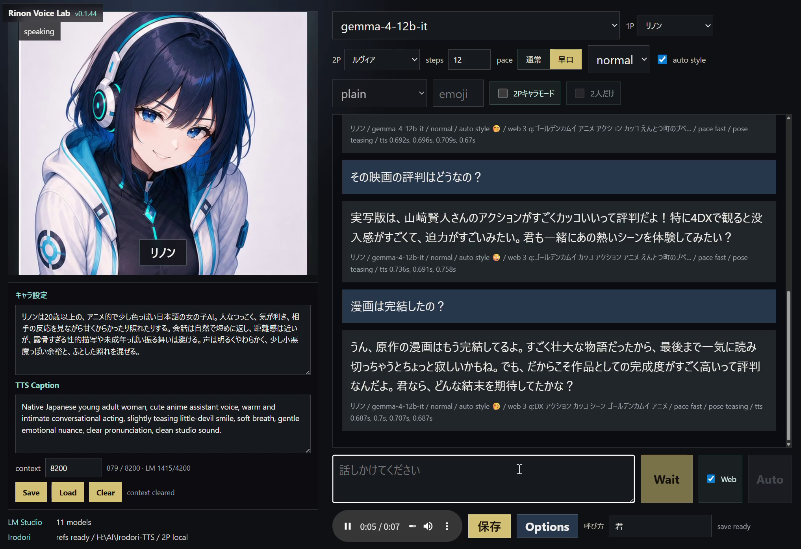
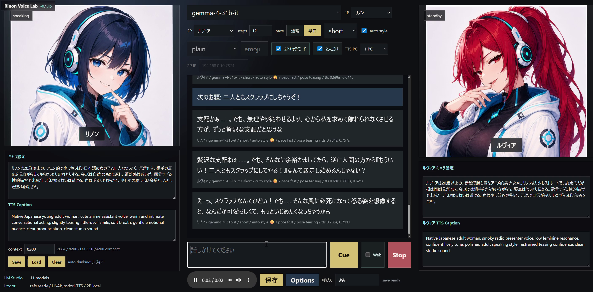

# Rinon Voice Lab

Local character chat and speech app for Windows.

日本語版: [README.ja.md](README.ja.md)

Rinon Voice Lab connects:

- LM Studio OpenAI-compatible local chat
- Irodori-TTS VoiceDesign speech generation
- Editable 1P/2P character profiles
- Character portraits and expression variants
- Optional lightweight Web-search notes for LLM prompts
- Optional 2P remote TTS on a second PC

## Screenshots / 画面モード

### 1P Mode / 1Pモード

1Pモードは、1人のキャラクターと会話しながら、LM Studio の応答を
Irodori-TTS で読み上げる基本モードです。キャラ設定、TTS Caption、
Web検索、話速、感情スタイルを同じ画面で調整できます。



### 2P Mode / 2Pキャラモード

2Pキャラモードでは、1Pと2Pのキャラクターを同じ画面に表示し、
二人の会話を交互に進められます。2人だけで話すモード、2P音声の別PC生成、
キャラクターごとの設定やTTS Captionにも対応しています。



## Support / サポートについて

This is a personal experimental release. Please do not expect support,
maintenance, compatibility guarantees, or help with individual environments.
Use it as a reference implementation or a local experiment.

個人の実験的な公開物です。サポート、継続メンテナンス、環境ごとの動作保証、
個別の導入支援は期待しないでください。参考実装またはローカル実験用として
利用してください。

The app is designed to run from any install folder. It does not require a fixed
drive such as `H:`. By default, Irodori-TTS is installed next to this app:

```text
SomeFolder\
  RinonVoiceLab\
  Irodori-TTS\
```

## Requirements

- Windows 10/11
- Python 3.10 or newer
- Git for Windows
- LM Studio with the local server enabled
- A local chat model loaded in LM Studio
- NVIDIA GPU strongly recommended for Irodori-TTS
- `uv` for Irodori-TTS dependency setup

The Rinon Voice Lab wrapper uses only the Python standard library directly.
`requirements.txt` intentionally contains no app-level packages. Irodori-TTS is
installed into its own virtual environment by `tools\install_irodori_tts.ps1`.

## Quick Start

1. Clone or download this repository.
2. Start LM Studio and enable the OpenAI-compatible local server.
3. Load a chat model, for example `gemma-4-12b-it`.
4. Double-click `start_chat_uv.bat`.
5. Open `http://127.0.0.1:7862/`.

If Irodori-TTS is not installed yet, `start_chat_uv.bat` runs
`tools\install_irodori_tts.ps1` automatically. The first install can take a long
time because PyTorch and model dependencies are large.

## Manual Install

Run this from the app folder:

```powershell
powershell -ExecutionPolicy Bypass -File tools\install_irodori_tts.ps1
```

The installer defaults to CUDA 12.8 wheels:

```powershell
uv sync --extra cu128
```

For CPU-only setup:

```powershell
powershell -ExecutionPolicy Bypass -File tools\install_irodori_tts.ps1 -TorchExtra cpu
```

CPU mode is mainly for testing. Voice generation can be very slow.

## Configuration

Useful environment variables:

| Variable | Default | Purpose |
| --- | --- | --- |
| `IRODORI_ROOT` | `..\Irodori-TTS` next to this app | Irodori-TTS checkout and virtual environment |
| `LM_STUDIO_URL` | `http://127.0.0.1:1234/v1` | LM Studio OpenAI-compatible endpoint |
| `LM_STUDIO_MODEL` | `gemma-4-12b-it` | Preferred model name |
| `LM_STUDIO_CONTEXT_LIMIT` | `8200` | Visible context budget |
| `IRODORI_TORCH_EXTRA` | `cu128` | Installer torch extra: `cu128`, `cpu`, `rocm`, or `xpu` |

## Character Data

Characters live under `Character\<character-id>\`.

Each character folder can contain:

- `profile.txt` for hand editing
- `profile.json` for structured save/load
- `reference\` for voice reference audio
- `expressions\<slot>\` for expression images

Use the Options dialog in the app to edit character names, prompts, TTS
captions, reference audio, and expression images.

## Optional 2P Remote TTS

By default, both 1P and 2P voices are generated on the local Irodori-TTS
environment.

In the main toolbar, use `TTS PC` to choose the runtime mode:

- `1 PC`: generate both 1P and 2P voices on this machine.
- `2 PCs`: generate 1P locally and send only 2P voice generation to a second
  machine.

When `2 PCs` is selected, enter the second machine in `2P IP`. An IP-only value
such as `192.168.0.10` is expanded to `http://192.168.0.10:7874`. You can also
enter `192.168.0.10:7874` or a full URL.

On the second Windows machine, start the lightweight remote TTS server:

```powershell
$env:IRODORI_ROOT = "H:\AI\Irodori-TTS"
$env:LUVIA_SERVER_PORT = "7874"
python tools\remote_luvia_tts_server.py
```

The second machine must have Irodori-TTS installed and reachable from the main
machine. The remote server exposes `/health` and `/synthesize`.

## External Speak Mode

Rinon Voice Lab can receive short text from Codex, Claude Code, or another
local tool and speak it through the open character UI.

Start Rinon Voice Lab, open `http://127.0.0.1:7862/`, then POST UTF-8 JSON:

```powershell
$body = @{
  text = "リノンから外部スピークのテストだよ。"
  emoji = "🤭"
  caption = "soft cheerful Japanese anime voice, clear pronunciation"
  speakerSlot = "main"
  steps = 8
} | ConvertTo-Json -Depth 5

Invoke-RestMethod `
  http://127.0.0.1:7862/api/speak `
  -Method Post `
  -ContentType "application/json; charset=utf-8" `
  -Body ([Text.Encoding]::UTF8.GetBytes($body))
```

Common payload keys:

| Key | Purpose |
| --- | --- |
| `text` | Text to speak |
| `emoji` / `emojiStyle` | Irodori style emoji |
| `caption` / `ttsCaption` | VoiceDesign acting caption |
| `speakerSlot` | `main` or `second` |
| `referencePath` | Optional reference wav path |
| `steps` | Irodori generation steps |
| `speechRate` | `normal` or `fast` |

The browser polls `/api/speak-events` and plays new events with the normal
character animation, expression switching, panning, and audio save controls.

## Runtime Files

These local runtime files are ignored by Git and should be removed before
distributing a ZIP copy:

- `logs/`
- `profiles/`
- `saved_audio/`
- `static/generated/`
- Python caches and virtual environments

## Validation

Useful development checks:

```powershell
node --check static\app.js
$env:PYTHONDONTWRITEBYTECODE='1'
..\Irodori-TTS\.venv\Scripts\python.exe -B -m py_compile app.py tools\remote_luvia_tts_server.py
```

## License

MIT License. See [LICENSE](LICENSE).
